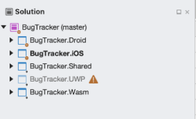
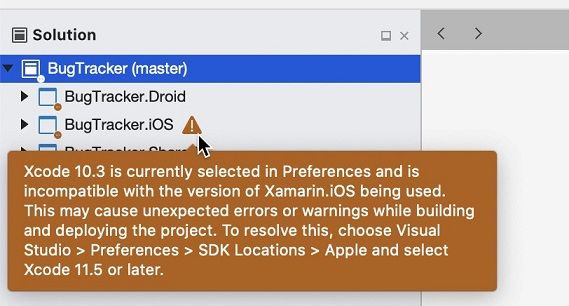
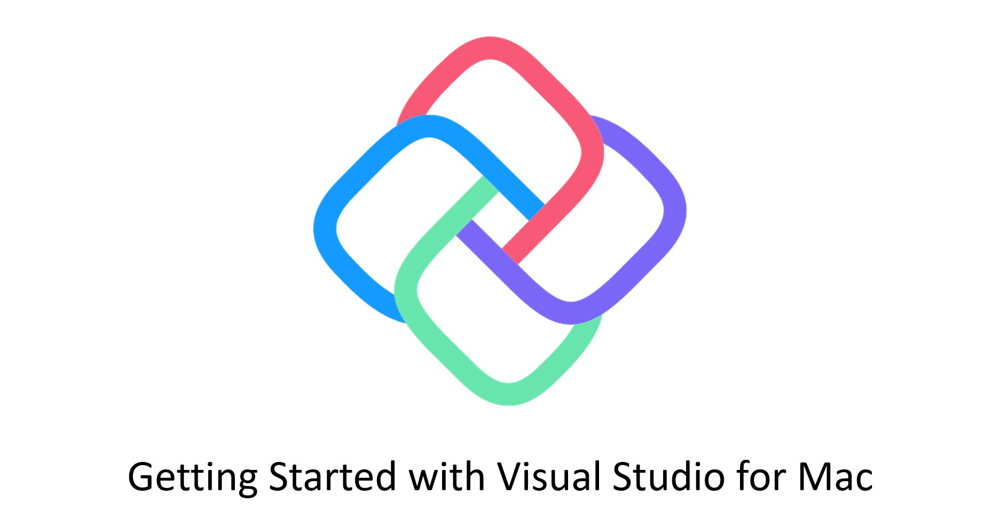

# Getting Started on Visual Studio For Mac

While it is easier to create apps using Uno on Windows, you can also create all but UWP apps on your Mac.

## Prerequisites
* [**Visual Studio for Mac 8.8**](https://visualstudio.microsoft.com/vs/mac/)
* [**Xcode**](https://apps.apple.com/us/app/xcode/id497799835?mt=12) 10.0 or higher
* An [**Apple ID**](https://support.apple.com/en-us/HT204316)
* [.NET Core SDK 3.1](https://dotnet.microsoft.com/download/dotnet-core/thank-you/sdk-3.1.404-macos-x64-installer)
* [**GTK+3**](https://formulae.brew.sh/formula/gtk+3) for running the Skia/GTK projects

## Installing the dotnet new templates
In order to create a new Uno Project, you'll need to open a terminal and run the following:
```
dotnet new -i Uno.ProjectTemplates.Dotnet
```
Once done, in Visual Studio for Mac, open the preference menu:
- On left side, open the **Other** then **Preview Features** menu
- Check the **Show all .NET Core templates in the New Project dialog**

## Create a new project
1. To create a new project:
    - Click the **New** button on the welcome screen
    - Select **Cross Platform App (Uno Platform)**
    - Choose a name then click create

1. Once created, you should see your folder structure set up like this:
\
    - If you have a warning symbol on your iOS project, make sure you have the minimum version of Xcode installed.
\
To update, go to `Visual Studio > Preferences > Projects > SDK Locations > Apple` and select Xcode 12 or higher.
Restart Visual Studio.
1. The `dotnet new` template contains WPF projects only compatible with Windows that need to be removed manually:
    - Select the `MyProject.Skia.Wpf` and `MyProject.Skia.Wpf.Host`
    - Right click to remove them from the solution.
    - Note that you can create a `dotnet new` project without those two projects with:
    ```bash
    dotnet new unoapp -o MyProject --skia-wpf=false
    ```
1. You can now run on iOS, Android, and macOS by setting your startup project and running.

   
Note: You will not be able to build the UWP and WPF projects on a Mac. All changes to this project must be made on Windows.

### Build and Run for WebAssembly

Building for WebAssembly takes a few more steps:

1. Set `MyProject.Wasm` to startup project
2. Build the project
3. In the terminal, navigate to your build output. This will typically be: `MyProject.Wasm > bin > Debug > netstandard2.0 > dist > server.py` Run the `server.py` program.
4. In your browser, open localhost:8000. 

### Video Tutorial
[](http://www.youtube.com/watch?v=ESGJr6kHQg0 "")
