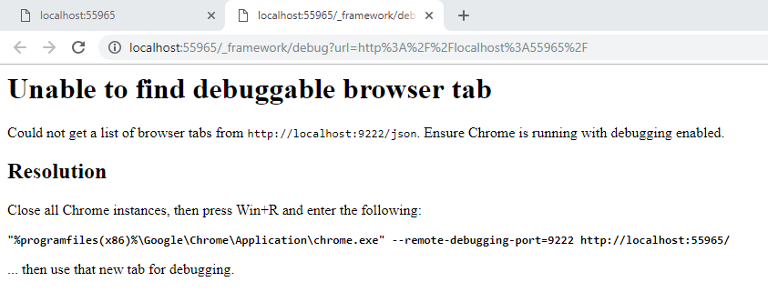
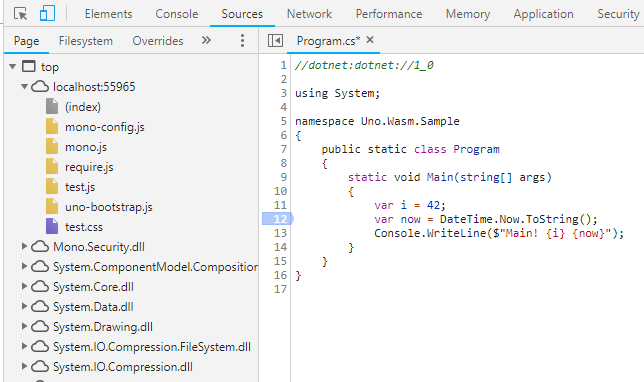

# Getting Started with the Uno Platform

## Prerequisites
* Visual Studio 2017 15.5 or later, with :
	* Xamarin component, with the iOS Remote Simulator installed
	* A working Mac with Visual Studio for Mac, XCode 8.2 or later installed
	* The google Android x86 emulators

## Create an application from the solution template

To easily create an multi-platform application:
* Install the [Uno Solution Template Visual Studio Extension](https://marketplace.visualstudio.com/items?itemName=nventivecorp.uno-platform-addin)
* Create a new C# solution using the **Cross-Platform Library (Uno Platform)** template, from Visual Studio's **Start Page** :

* Update to the latest nuget package named `Uno.UI`, make sure to check the `pre-release` box.
* To debug the iOS head, select the `Debug|iPhoneSimulator` configuration
* To debug the Android head, select the `Debug|AnyCPU` configuration
* To debug the UWP head, select the `Debug|x86` configuration
* To run the WebAssembly (Wasm) head, select **IIS Express** and press **Ctrl+F5**. See below for the debugging instructions.

## Using the WebAssembly C# Debugger
- Ensure that 
  - **IIS Express** is enabled in your debugging toolbar
  - **Chrome** is active WebBrowser
  - 

- Press *Ctrl+F5*
- Once your application is loaded, press **Alt+Shift+D**, a new tab will open
- You will get an error message telling you that Chrome has not been opened

-  Close all your chrome instances and run Chrome again using the provided command line
-  Once again, once your application is loaded, press **Alt+Shift+D**, a new tab will open.
- You will now get the Chrome DevTools to open listing all the .NET loaded assemblies on the Sources tab: 

- You can now set break points in the available source files
- Since the app's initialization has already started, you can refresh the original website tab, or use the smaller refresh button in the preview section of the Chrome DevTools:

