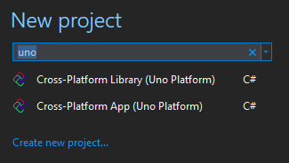
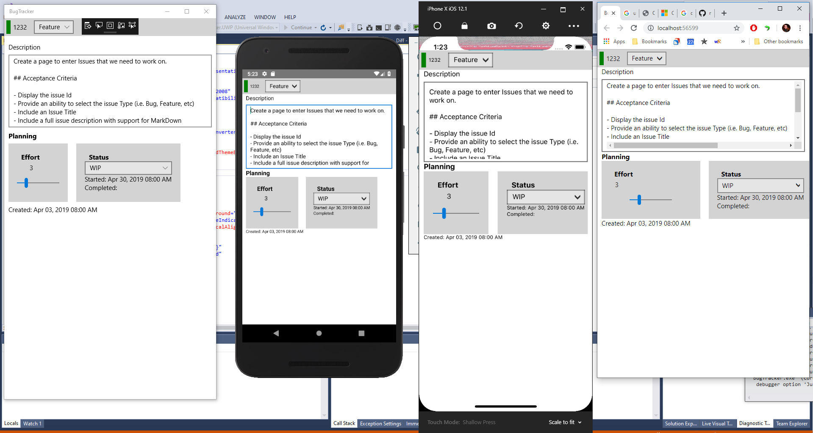

# Getting Started with the Uno Platform

## Prerequisites
* [**Visual Studio 2017 15.5 or later**](https://visualstudio.microsoft.com/), with:
    * **Universal Windows Platform component** installed

    

	* **Xamarin component** installed

    

    *
        * the iOS Remote Simulator installed (for iOS development)
	    * A working Mac with Visual Studio for Mac, XCode 8.2 or later installed (for iOS development)
	    * Google's Android x86 emulators or a physical Android device (for Android development)

    * **ASP.NET/web component** installed, along with .NET Core 2.2 (for WASM development)

    

## Create an application from the solution template

To easily create a multi-platform application:
* Install the [Uno Solution Template Visual Studio Extension](https://marketplace.visualstudio.com/items?itemName=nventivecorp.uno-platform-addin)
* Create a new C# solution using the **Cross-Platform App (Uno Platform)** template, from Visual Studio's **Start Page**:

* Update to the latest nuget package named `Uno.UI`, make sure to check the `pre-release` box.
* To debug the iOS head, select the `Debug|iPhoneSimulator` configuration
* To debug the Android head, select the `Debug|AnyCPU` configuration
* To debug the UWP head, select the `Debug|x86` configuration
* To run the WebAssembly (Wasm) head, select **IIS Express** and press **Ctrl+F5**. See [here](debugging-wasm.md) for debugging instructions.

### Enabling XAML Intellisense

[Intellisense](https://docs.microsoft.com/en-us/visualstudio/ide/using-intellisense) is supported in XAML when the UWP head is active:

If XAML Intellisense isn't working on a freshly-created project, try the following steps:
1. Build the UWP head.
2. Close all XAML documents.
3. Close and reopen Visual Studio.
4. Reopen XAML documents.

### Creating an app with Uno - tutorial

See the [Creating an App tutorial](getting-started-tutorial-1.md) for a step-by-step guide to creating a working app with Uno.

## Next steps

* For code samples, check out the [Uno Gallery and Playground](https://github.com/nventive/Uno.Playground) repository.

* The Uno Platform promotes a 'UWP-first' development approach. Microsoft's [documentation](https://docs.microsoft.com/en-us/windows/uwp/develop/) on the UWP framework is an essential resource.

* For Uno-specific information, consult the docs here, including a list of [supported features](supported-features.md) and [general development tips](using-uno-ui.md).

* If you're not sure how to do something with Uno, and you think others could benefit from the knowledge, you can post the question on [StackOverflow](https://stackoverflow.com/questions/ask?tags=uno-platform) using the 'uno-platform' tag. Remember to check if the question [already exists](https://stackoverflow.com/questions/tagged/uno-platform) and follow StackOverflow's [question guidelines](https://stackoverflow.com/help/how-to-ask). You'll also need to sign up to StackOverflow if you're not already.

* If you think you've encountered a bug (eg, something works on UWP but not on another platform), [create an issue on GitHub](https://github.com/nventive/Uno/issues) if there's no existing issue. We hate bugs, but we love bug reports!

* If you have any questions for the Uno Platform team directly, visit our [Gitter channel](https://gitter.im/uno-platform/Lobby).
