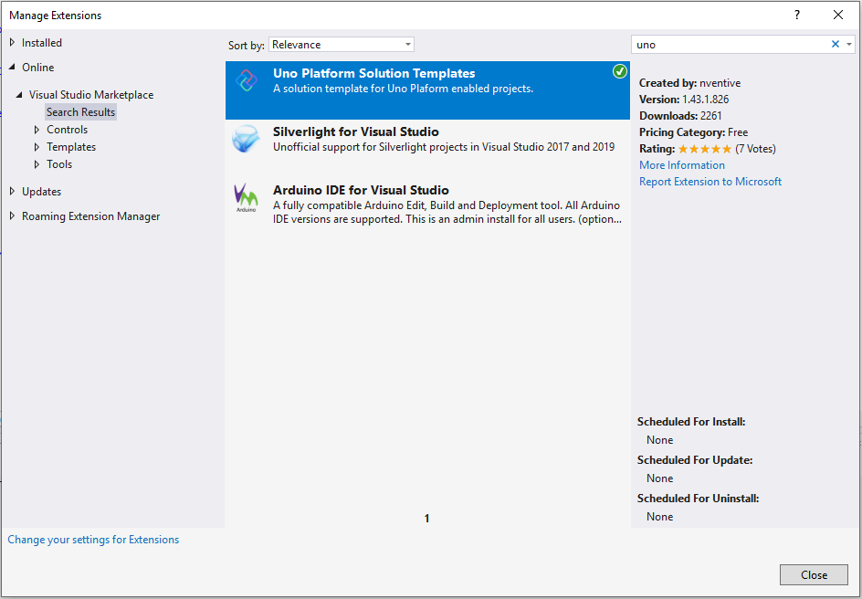
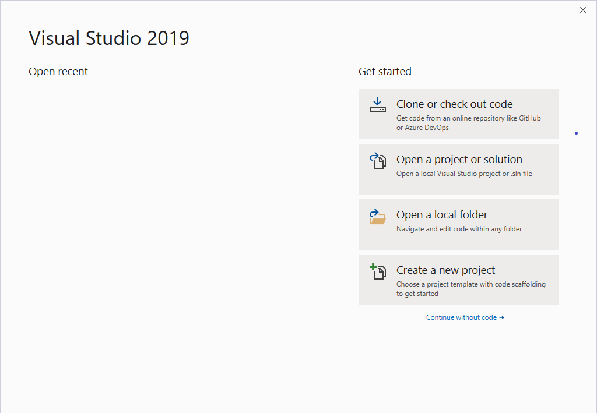
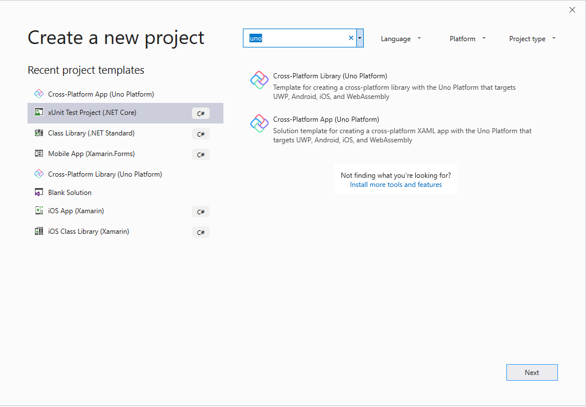
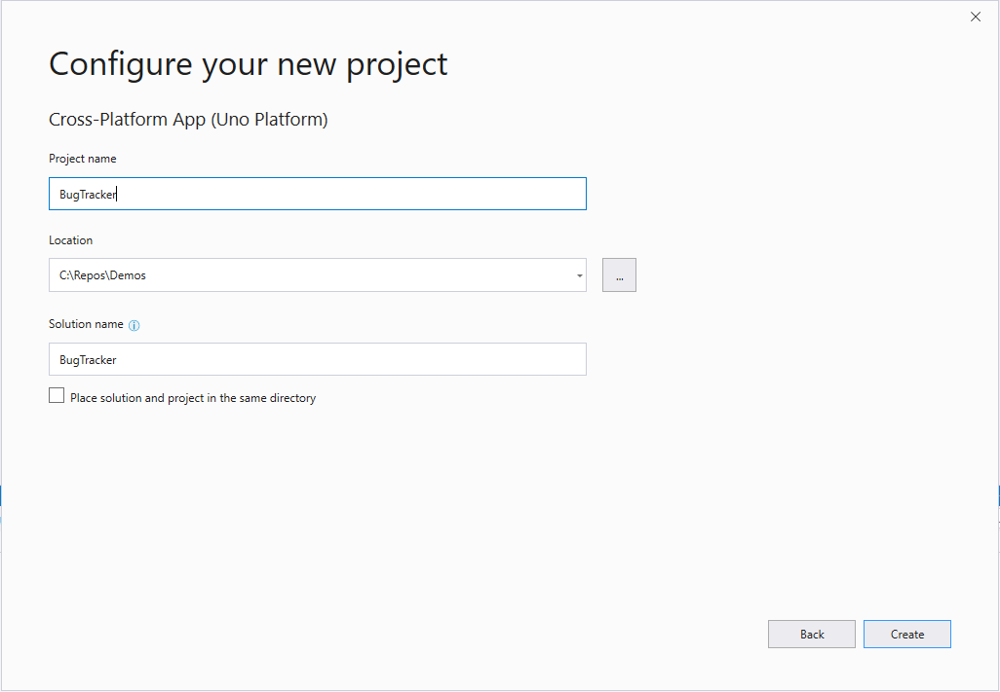
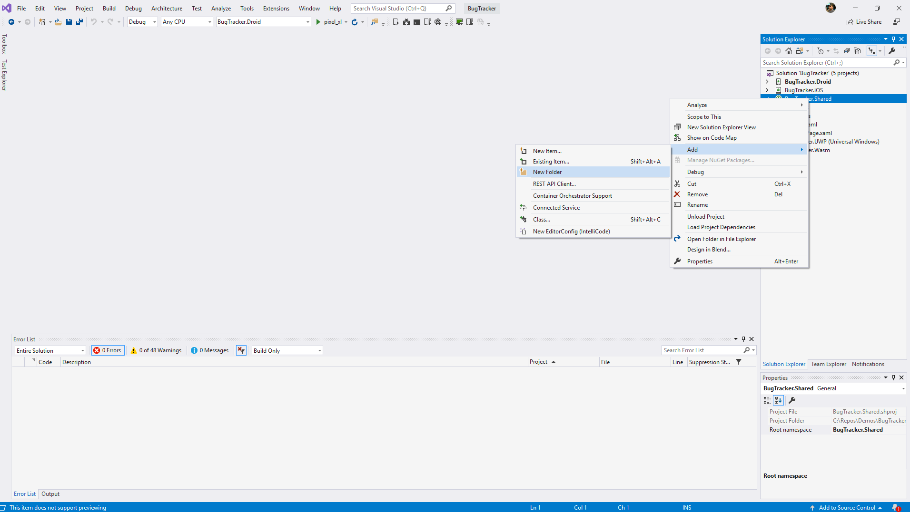

# Create a Single Page App with Uno

[Download Sample](https://github.com/nventive/Uno.GettingStarted)

In this tutorial you will learn how to:

- Add the Uno Project Templates to Visual Studio
- Create a new Project with Uno
- Learn basics on Model Binding

The tutorial walks through creating a cross platform application with Uno, which enables you to see a single Issue entry.

### Prerequisites

- Visual Studio 2019 (latest release), with the **Universal Windows Platform**, **Mobile development with .NET**, and **ASP**.**NET and web** workloads installed.
- Knowledge of C#.
- (optional) A paired Mac to build the iOS project.

For more information about these prerequisites, see [Installing Xamarin](https://docs.microsoft.com/en-us/xamarin/get-started/installation/index.md). For information about connecting Visual Studio 2019 to a Mac build host, see [Pair to Mac for Xamarin.iOS development](https://docs.microsoft.com/en-us/xamarin/ios/get-started/installation/windows/connecting-to-mac/index.md).

##### On Windows

To run the WebAssembly (Wasm) head, select **IIS Express** and press **Ctrl+F5** or choose 'Start without debugging' from the menu. Note that **F5** will *not* work because Visual Studio debugging isn't supported. See [here](debugging-wasm.md) for debugging instructions through Chrome.

## Installing the App Templates with Visual Studio 2019

1. Launch Visual Studio 2019, then click `Continue without code`. Click `Extensions` -> `Manage Extensions` from the Menu Bar.

    

1. In the Extension Manager expand the Online node and search for `Uno`. Download the `Uno Platform Solution Templates` extension and restart Visual Studio.

    

## Getting Started

1. Open Visual Studio 2019 and click on `Create new project`. 

    

1. Search for the `Uno` templates, select the `Cross-Platform App (Uno Platform)` then click `Next`.

    

1. In the `Configure your new project` window, set the `Project name` to `BugTracker`, choose where you would like to save your project and click the `Create` button.

    

    > [!IMPORTANT]
    > The C# and XAML snippets in this tutorial requires that the solution is named **BugTracker**. Using a different name will result in build errors when you copy code from this tutorial into the solution.

1. Right click on the Solution and select `Manage NuGet Packages for Solution` from the context menu.

    - Click on the Updates tab, and update any of the packages that may need to update.
    - Click back on the Browse tab and install the following NuGet Packages to each of the projects in your solution:
      - Refactored.MvvmHelpers

### Setting Up Our Model

1. Add a Models folder in the Shared Project.

    

1. Add a new class and then paste in the following code:

    ```cs
    public class IssueItem : ObservableObject
    {
        private int id;
        public int Id
        {
            get => id;
            set => SetProperty(ref id, value);
        }

        private IssueType type;
        public IssueType Type
        {
            get => type;
            set => SetProperty(ref type, value);
        }

        private string title;
        public string Title
        {
            get => title;
            set => SetProperty(ref title, value);
        }

        private string description;
        public string Description
        {
            get => description;
            set => SetProperty(ref description, value);
        }

        private IssueStatus status;
        public IssueStatus Status
        {
            get => status;
            set => SetProperty(ref status, value);
        }

        private int effort;
        public int Effort
        {
            get => effort;
            set => SetProperty(ref effort, value);
        }

        private DateTimeOffset createdAt = DateTimeOffset.Now.ToLocalTime();
        public DateTimeOffset CreatedAt
        {
            get => createdAt;
            set => SetProperty(ref createdAt, value);
        }

        private DateTimeOffset? startedAt;
        public DateTimeOffset? StartedAt
        {
            get => startedAt;
            set => SetProperty(ref startedAt, value);
        }

        private DateTimeOffset? completedAt;
        public DateTimeOffset? CompletedAt
        {
            get => completedAt;
            set => SetProperty(ref completedAt, value);
        }
    }

    public enum IssueType
    {
        Bug,
        Issue,
        Task,
        Feature
    }

    public enum IssueStatus
    {
        Icebox,
        Planned,
        WIP,
        Done,
        Removed
    }
    ```

    > [!IMPORTANT]
    > Because we want to be able to respond to changes in our model we'll want to bring in the ObservableObject in the MvvmHelpers namespace, from the Refactored.MvvmHelpers NuGet pacakge we installed earlier.

### Setting up our Page

1. To start let's create a simple converter that will format a value to a string. Create a Converters folder, then create a new class `StringFormatConverter`

    ```cs
    public class StringFormatConverter : IValueConverter
    {
        public object Convert(object value, Type targetType, object parameter, string language)
        {
            return string.Format(parameter.ToString(), value);
        }

        public object ConvertBack(object value, Type targetType, object parameter, string language)
        {
            throw new NotImplementedException();
        }
    }
    ```

1. Next, we will add some base properties to bind to in our XAML. In the **Solution Explorer**, double-click **MainPage.xaml.cs** to open, then add the following code.

    ```cs
    public sealed partial class MainPage : Page
    {
        public static readonly DependencyProperty IssueItemProperty =
            DependencyProperty.Register(nameof(Item), typeof(IssueItem), typeof(MainPage), new PropertyMetadata(default(IssueItem)));

        public MainPage()
        {
            this.InitializeComponent();
        }

        public IssueItem Item
        {
            get => (IssueItem)GetValue(IssueItemProperty);
            set => SetValue(IssueItemProperty, value);
        }

        public IssueStatus[] StatusList => new[]
        {
            IssueStatus.Icebox,
            IssueStatus.Planned,
            IssueStatus.WIP,
            IssueStatus.Done,
            IssueStatus.Removed
        };

        public IssueType[] IssueTypeList => new[]
        {
            IssueType.Bug,
            IssueType.Feature,
            IssueType.Issue,
            IssueType.Task
        };

        protected override void OnNavigatedTo(NavigationEventArgs e)
        {
            Item = new IssueItem
            {
                Id = 1232,
                Title = "Getting Started",
                Description = @"Create a page to enter Issues that we need to work on.

    ## Acceptance Criteria

    - Display the issue Id
    - Provide an ability to select the issue Type (i.e. Bug, Feature, etc)
    - Include an Issue Title
    - Include a full issue description with support for Markdown
    - Include an issue effort
    - Include an ability for a developer to update the Status (i.e Icebox, WIP, etc)

    ## Additional Comments

    We would like to have a visual indicator for the type of issue as well as something to visualize the effort involved",
                Effort = 3,
                Status = IssueStatus.WIP,
                Type = IssueType.Feature,
                CreatedAt = new DateTimeOffset(2019, 04, 03, 08, 0, 0, TimeSpan.FromHours(-8)),
                StartedAt = new DateTimeOffset(2019, 04, 30, 08, 0, 0, TimeSpan.FromHours(-8))
            };
        }
    }
    ```

1. Now that we have some basic data to bind to, in the **Solution Explorer**, double-click **MainPage.xaml** to open, then add the following code. We will start by adding a XML Namespace for the Converters and Controls from the Microsoft Community Toolkit as shown below:

    ```xml
    <Page x:Class="BugTracker.MainPage"
          xmlns="http://schemas.microsoft.com/winfx/2006/xaml/presentation"
          xmlns:x="http://schemas.microsoft.com/winfx/2006/xaml"
          xmlns:converters="using:BugTracker.Converters"
          xmlns:d="http://schemas.microsoft.com/expression/blend/2008"
          xmlns:mc="http://schemas.openxmlformats.org/markup-compatibility/2006"
          xmlns:ios="http://nventive.com/ios"
          mc:Ignorable="d ios">
    ```

    > [!IMPORTANT]
    > We can bring in Platform Specific namespaces like shown above to specifically set properties for a specific Platform.

1. Now we will add the `StringFormatConverter` we created earlier to our Page Resources as shown below:

    ```xml
    <Page.Resources>
        <converters:StringFormatConverter x:Key="StringFormatConverter" />
    </Page.Resources>
    ```

1. Now we will update the Grid so that we define 6 rows with a small spacing between the rows to add a little padding between the row elements.

    ```xml
    <Grid Background="{ThemeResource ApplicationPageBackgroundThemeBrush}" RowSpacing="8">
      <Grid.RowDefinitions>
        <RowDefinition Height="Auto" />
        <RowDefinition Height="Auto" />
        <RowDefinition Height="Auto" />
        <RowDefinition Height="Auto" />
        <RowDefinition Height="Auto" />
        <RowDefinition Height="*" />
      </Grid.RowDefinitions>

    </Grid>
    ```

1. Inside the Grid, beneath the RowDefinitions, we will now add our first row that will contain a Header with a TextBlock containing the Issue Id, and a ComboBox to select what type of issue we are working on. Because our model is a property of the Page we will use **x:Bind** to bind to our Item property. You will notice that you can dot into the property to Bind directly to a property of the Item model.

    ```xml
    <StackPanel Grid.Row="0" Orientation="Horizontal" Background="LightGray" Padding="5">
      <Canvas Background="Blue" Width="10" x:Name="IssueTypeIndicator" />
      <TextBlock Text="{x:Bind Item.Id}" Margin="6,0" VerticalAlignment="Center" />
      <ComboBox x:Name="IssueTypeBox"
                ItemsSource="{x:Bind IssueTypeList}"
                SelectedItem="{x:Bind Item.Type,Mode=TwoWay}"
                SelectionChanged="IssueType_SelectionChanged"
                PlaceholderText="Enter the Issue Type"
                HorizontalAlignment="Stretch"
                Margin="10,0,0,0"/>
    </StackPanel>
    ```

    > [!IMPORTANT]
    > Take note that we have added a reference to an event handler on the ComboBox. We will add this later in the code behind.

1. Now after the StackPanel we added in the last step, we will add an area that we can edit the multi-line description of the Issue.

    ```xml
    <TextBox Text="{x:Bind Item.Description,Mode=TwoWay}"
             Grid.Row="2"
             AcceptsReturn="True"
             Header="Description"
             Height="200"
             Margin="10,0"
             PlaceholderText="Enter Text Here" />
    ```

1. Finally we will add the last section to our layout to handle planning. Here will will show the estimated Effort it will take to resolve the issue, what the current status is, and when the Issue was Started and Completed.

    ```xml
    <TextBlock Text="Planning" FontWeight="Bold" FontSize="16" Grid.Row="3" Margin="10,0" />

    <StackPanel Orientation="Horizontal" Grid.Row="4" Margin="10,0" Spacing="20">
      <StackPanel Background="LightGray" Padding="20">
        <TextBlock Text="Effort" FontWeight="Bold" FontSize="16" Margin="10,0" />
        <TextBox Text="{x:Bind Item.Effort,Mode=TwoWay}"
                   HorizontalTextAlignment="Center"
                   HorizontalAlignment="Center"
                   HorizontalContentAlignment="Center"
                   BorderBrush="Transparent"
                   Background="Transparent"/>
        <Slider Value="{x:Bind Item.Effort,Mode=TwoWay}" Width="100" Minimum="0" Maximum="15" />
      </StackPanel>
      <StackPanel Background="LightGray"
                  Padding="20">
        <TextBlock Text="Status" FontWeight="Bold" FontSize="16" Margin="10,0" />
        <ComboBox ItemsSource="{x:Bind StatusList}"
                  SelectedItem="{x:Bind Item.Status}"
                  HorizontalAlignment="Stretch"
                  SelectionChanged="StatusPicker_SelectionChanged" />
        <TextBlock Text="{x:Bind Item.StartedAt,Converter={StaticResource StringFormatConverter},ConverterParameter='Started: {0:MMM dd, yyyy hh:mm tt}',Mode=OneWay}" />
        <TextBlock Text="{x:Bind Item.CompletedAt,Converter={StaticResource StringFormatConverter},ConverterParameter='Completed: {0:MMM dd, yyyy hh:mm tt}',Mode=OneWay}" />
      </StackPanel>
    </StackPanel>

    <TextBlock Text="{x:Bind Item.CreatedAt, Converter={StaticResource StringFormatConverter}, ConverterParameter='Created: {0:MMM dd, yyyy hh:mm tt}'}" Grid.Row="5"
               Margin="10,0"/>
    ```

    > [!IMPORTANT]
    > Take note that we have added a reference to an event handler on the ComboBox. We will add this in the next step in the code behind.

1. Now that our Page is complete we can go back and add the event handlers in our code behind. This will allow us to handle changes and make necessary updates. In the **Solution Explorer**, double-click **MainPage.xaml.cs** to open, then add the following code.

    ```cs
    // Sets the time when we Complete or Start an issue.
    private void StatusPicker_SelectionChanged(object sender, SelectionChangedEventArgs args)
    {
        switch (Item.Status)
        {
            case IssueStatus.Removed:
            case IssueStatus.Done:
                if(Item.CompletedAt is null)
                    Item.CompletedAt = DateTimeOffset.Now.ToLocalTime();
                break;
            case IssueStatus.WIP:
                if(Item.StartedAt is null)
                    Item.StartedAt = DateTimeOffset.Now.ToLocalTime();
                break;
            default:
                Item.StartedAt = null;
                Item.CompletedAt = null;
                break;
        }
    }

    // Provides a unique color based on the type of Issue
    private void IssueType_SelectionChanged(object sender, SelectionChangedEventArgs args)
    {
        var color = Colors.Red;
        switch (IssueTypeBox.SelectedItem)
        {
            case IssueType.Feature:
                color = Colors.Green;
                break;
            case IssueType.Issue:
                color = Colors.Blue;
                break;
            case IssueType.Task:
                color = Colors.Yellow;
                break;
        }
        IssueTypeIndicator.Background = new SolidColorBrush(color);
    }
    ```

1. Build and run the project on each platform.

    You will notice as you make changes to the Issue type, you will see the indicator in the upper left hand corner changing colors as well.

## Next steps

In this tutorial, you have learned how to:

- Add the Uno Project Templates to Visual Studio
- Create a new Project with Uno
- Learn basics on Model Binding

Coming soon: see how we can create a list of pages, navigate between them passing parameters, and store our issues.